# todo-service

docker-compose up -d   
go run cmd/app/main.go

Создание пользователя

Создание пользователя c username который уже есть
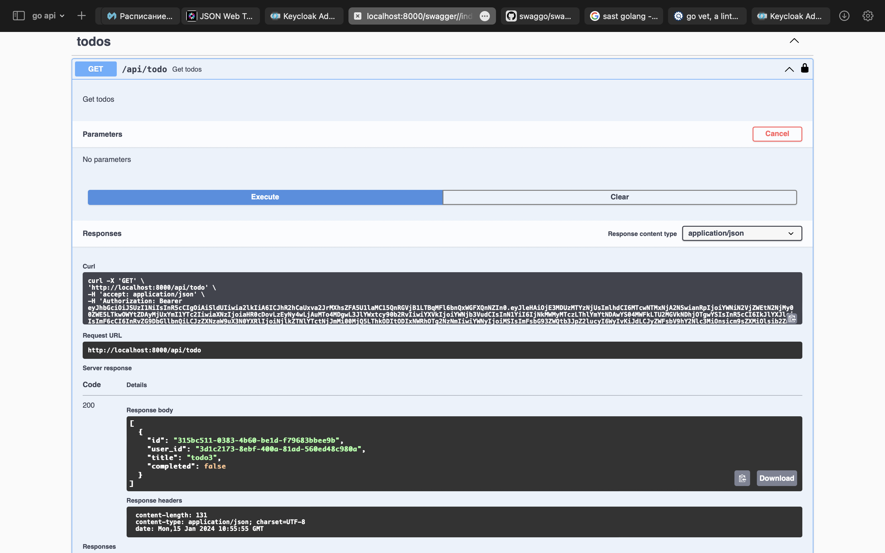
Создание todo
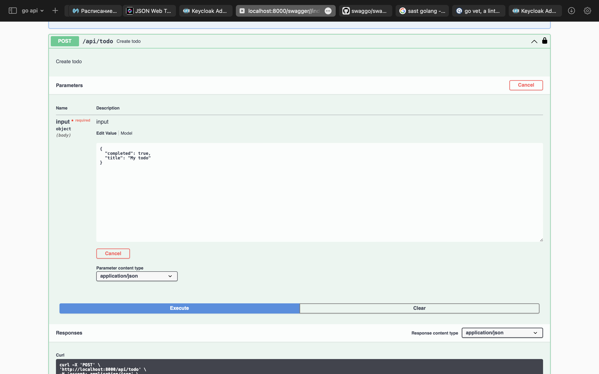
Получние todos
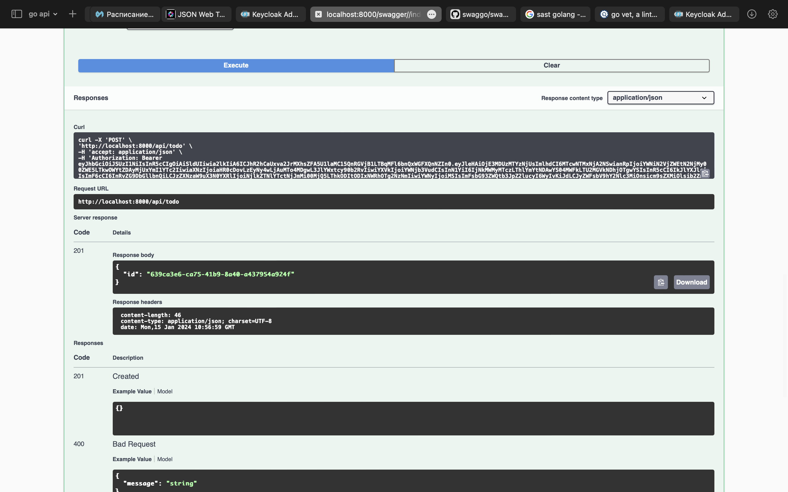
Удаление todo под пользователем, которому не принадлежит todo
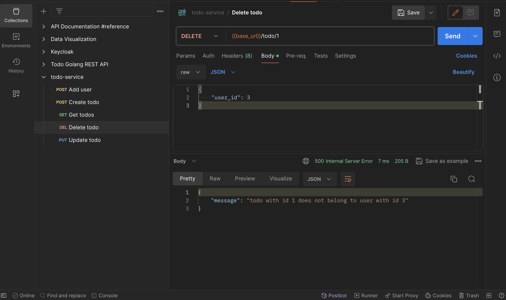
Удаление todo под пользователем, которому принадлежит todo
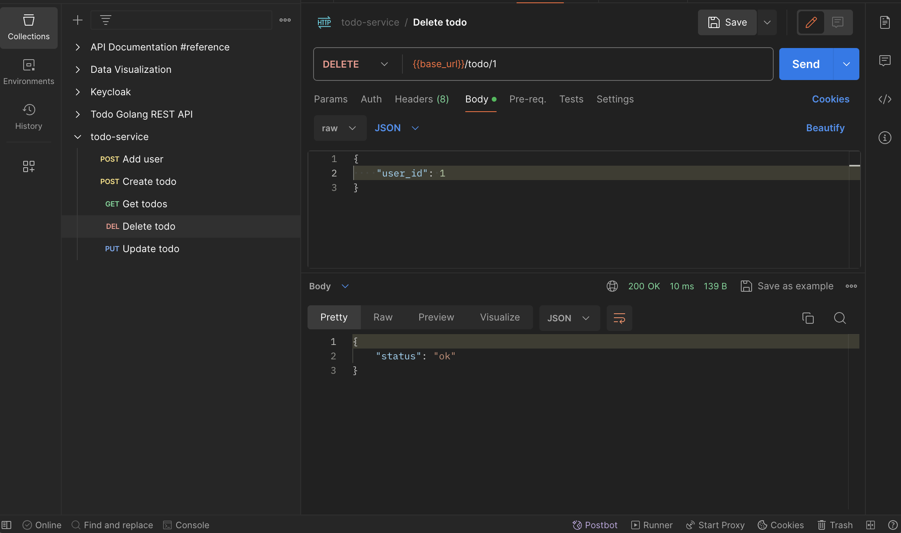
Удаление todo по id, которого нет
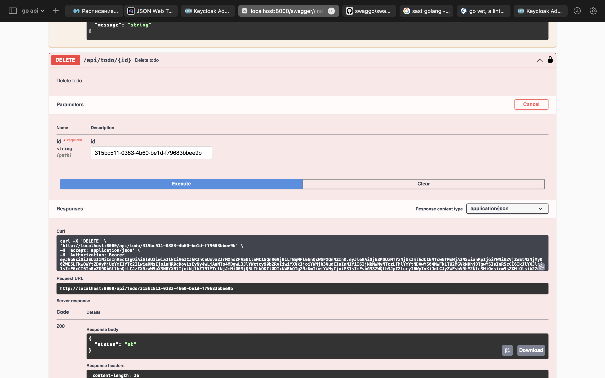
Проверка удаления
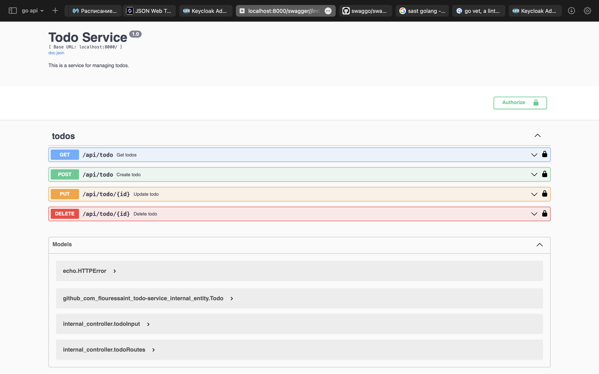
Изменение todo, которой нет
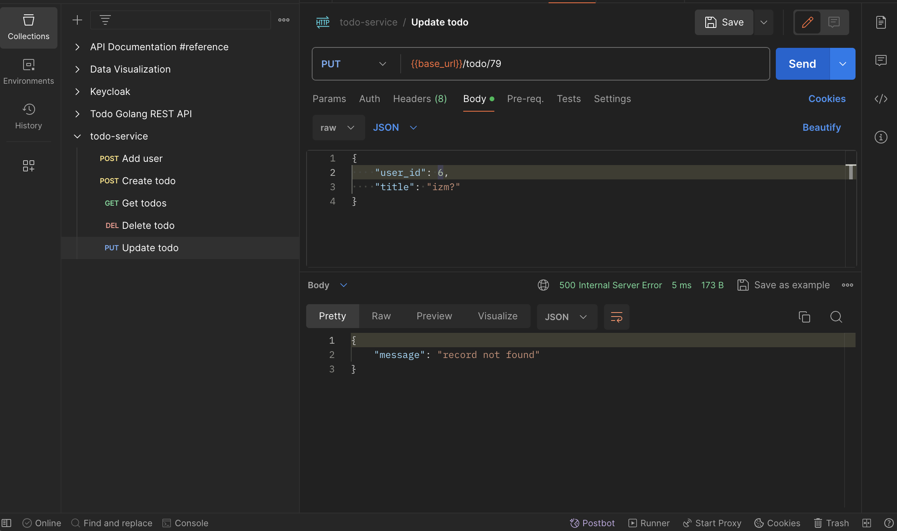
Изменение todo под пользователем, которому не принадлежит todo
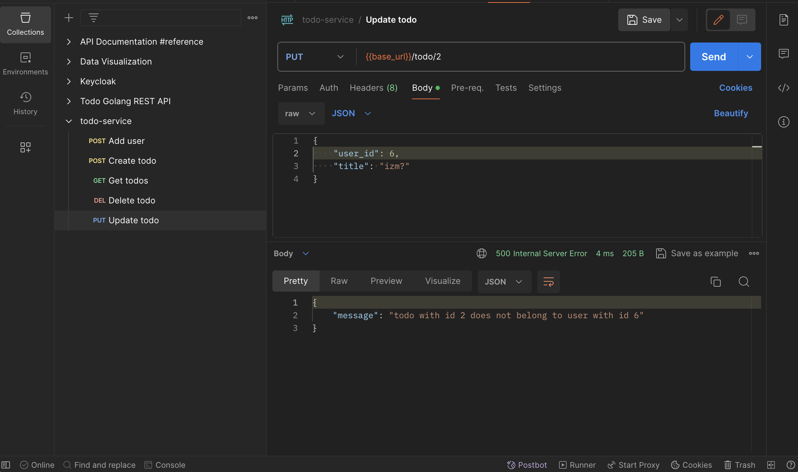
Изменение todo под пользователем, которому принадлежит todo
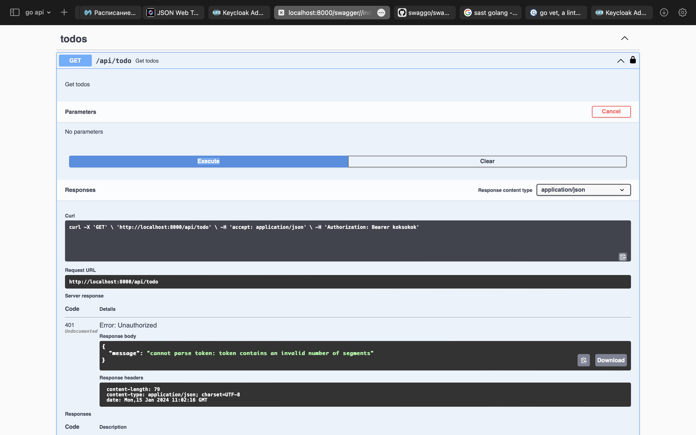
Проверка изменения
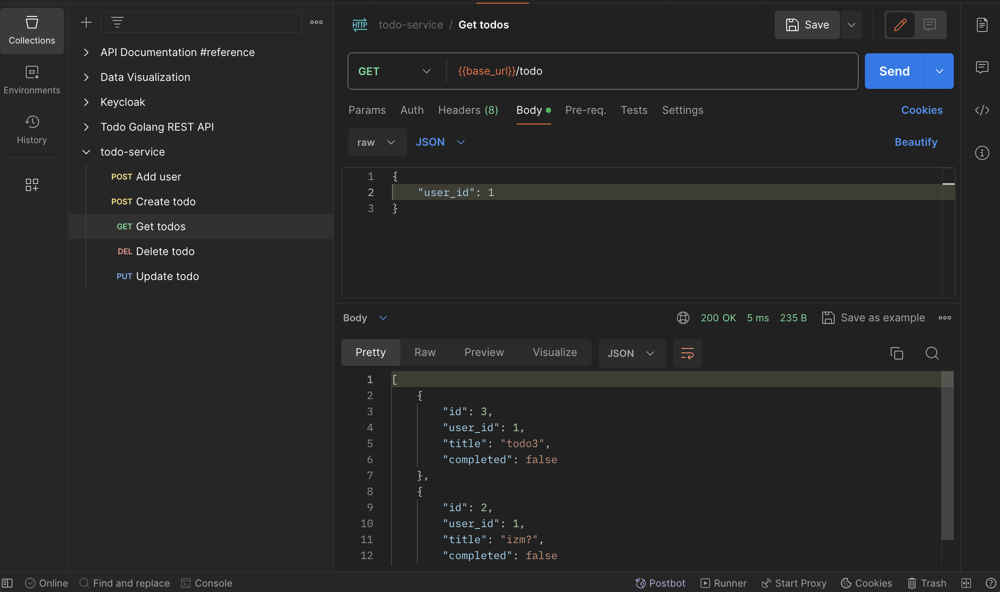