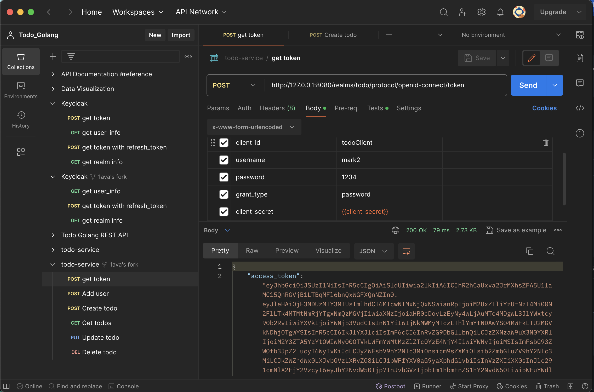
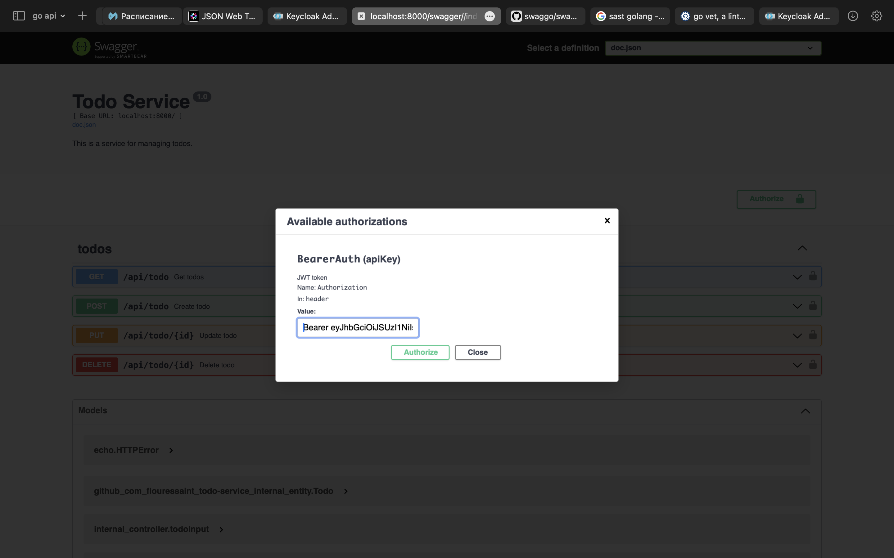
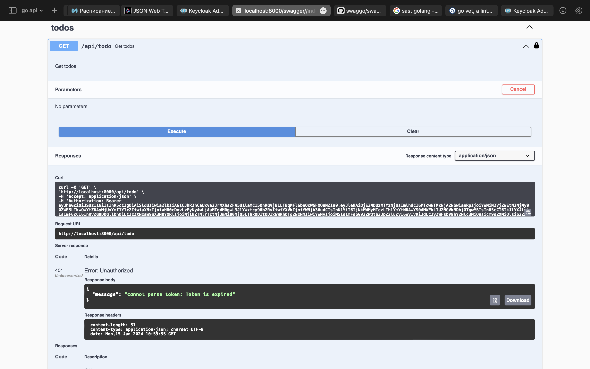
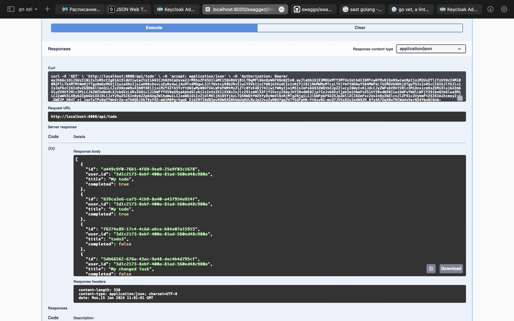
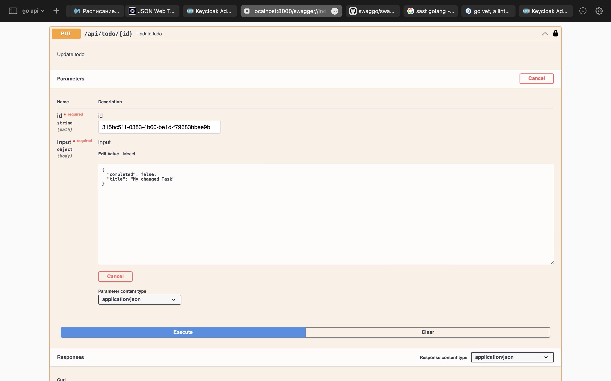

# todo-service

### Run
    docker-compose up -d   
    go run cmd/app/main.go

### get access token

### Auth  

token expired
    
invalid token
    

### Get todos

### Create todo

### Change todo

### Delete todo

### Пользователь может получить доступ только к своим задачам

## SAST
### goSec

Issues: 0

### Bearer

42 checks were run and no failures were detected.
